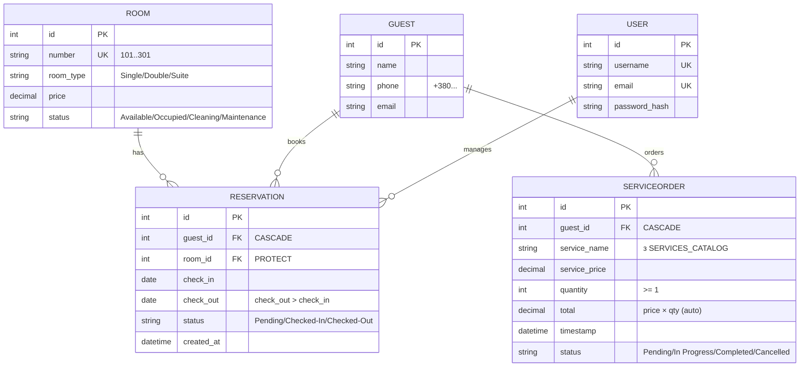

# 1.2. Проєктування бази даних

## ERD



**Зв’язки:**

- `Guest 1—N Reservation`, `Room 1—N Reservation` (номер захищено від
  видалення — `PROTECT`, гість видаляється каскадно — `CASCADE`).
- `Guest 1—N ServiceOrder` (каскадне видалення).
- `User` (штатний `auth_user` Django) не має FK-зв’язку — це оператор системи,
  заміна `users.json` + `auth.py` з хешуванням паролів (PBKDF2).

Мапінг Flet → Django: `storage/rooms.json → hotel_room`,
`guests.json → hotel_guest`, `reservations.json → hotel_reservation`,
`service_orders.json → hotel_serviceorder`, `users.json → auth_user`.

## Опис створених SQL-скриптів

Скрипти лежать у `Python_Djanglo/hotel/sql/` і дублюють схему міграції
`hotel/migrations/0001_initial.py` у вигляді чистого SQL (для звіту й ручного
розгортання).

### `01_schema.sql` — створення схеми (SQLite)

- `hotel_room`: `number UNIQUE`, `CHECK` на тип/статус, `price >= 0`.
- `hotel_guest`: `name`, `phone`, `email`.
- `hotel_reservation`: FK на гостя (`ON DELETE CASCADE`) і номер
  (`ON DELETE RESTRICT` — аналог `PROTECT`), `CHECK (check_out > check_in)`
  (аналог `Reservation.clean()`), індекси за `guest_id`, `room_id`, `status`.
- `hotel_serviceorder`: `quantity >= 1`, `service_price >= 0`, `total`
  (обчислюється в `ServiceOrder.save()` як `price × quantity`),
  індекси за `guest_id`, `status`.
- `PRAGMA foreign_keys = ON`.

### `02_seed.sql` — початкові дані

Порт `create_default_rooms()` з `hotel_data.py`:

```sql
INSERT OR IGNORE INTO hotel_room (number, room_type, price, status) VALUES
    ('101', 'Single', 50, 'Available'),
    ('102', 'Single', 50, 'Available'),
    ('201', 'Double', 80, 'Available'),
    ('202', 'Double', 80, 'Available'),
    ('301', 'Suite', 150, 'Available');
```

Каталог з 13 послуг (`SERVICES_CATALOG`) свідомо залишено в коді
(`hotel/models.py`), а не окремою таблицею: ціни фіксовані навчальним
завданням, а замовлення зберігає **копію ціни** (`service_price`) на момент
покупки — тож зміна прайса не ламає історію.

### Міграції Django

```bash
py manage.py makemigrations hotel   # → hotel/migrations/0001_initial.py
py manage.py migrate                 # застосовує схему + auth/session/admin
```

Перевірка: `py manage.py check` — без помилок; `py manage.py test hotel` — 8/8.
